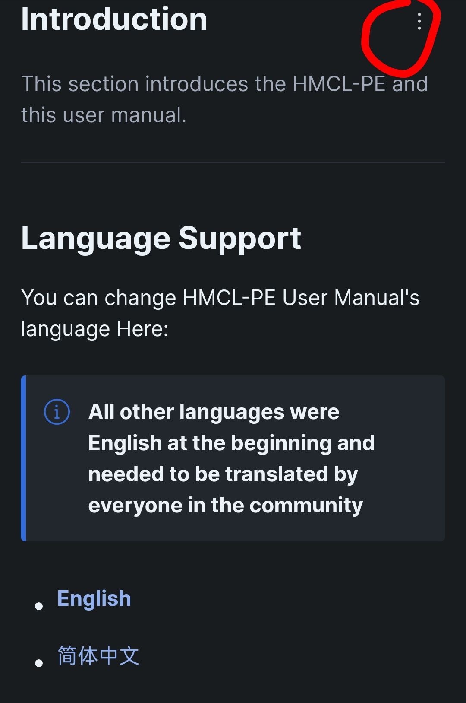
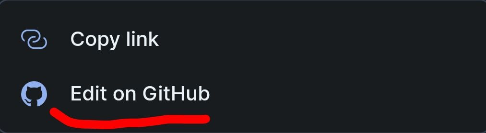
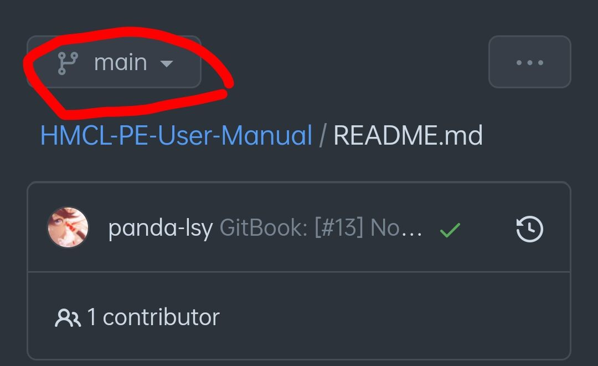
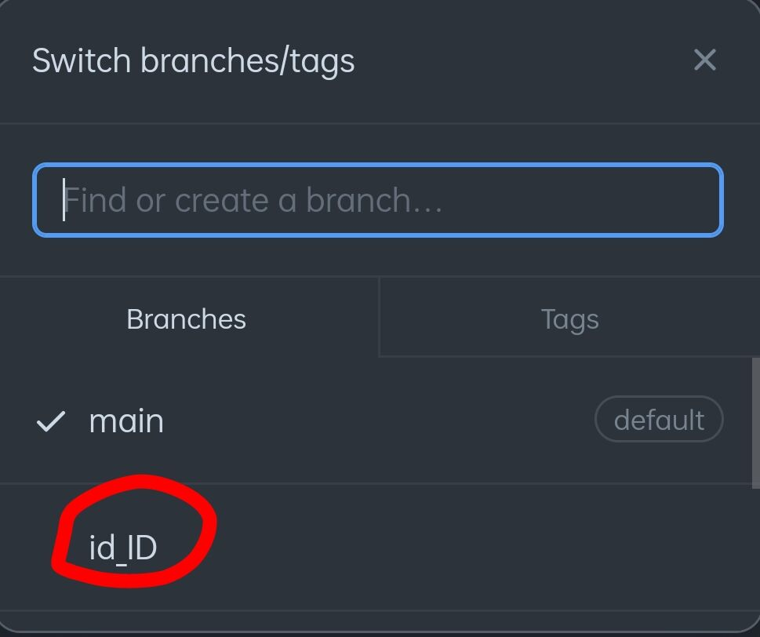
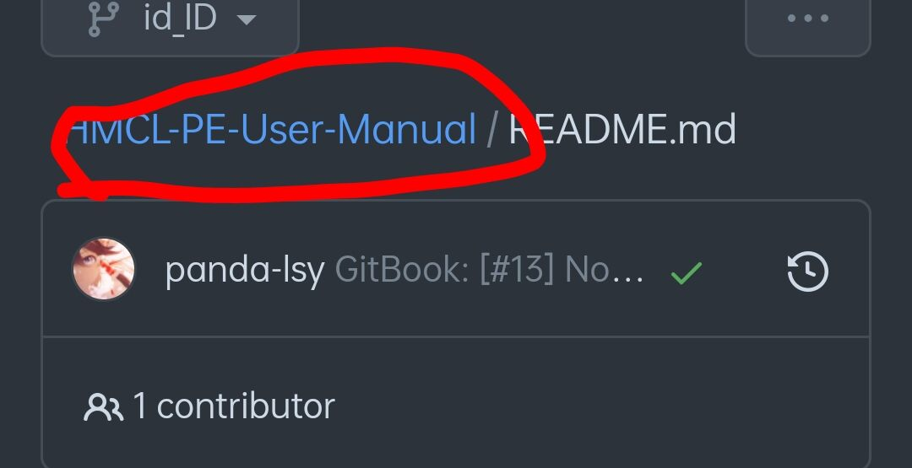
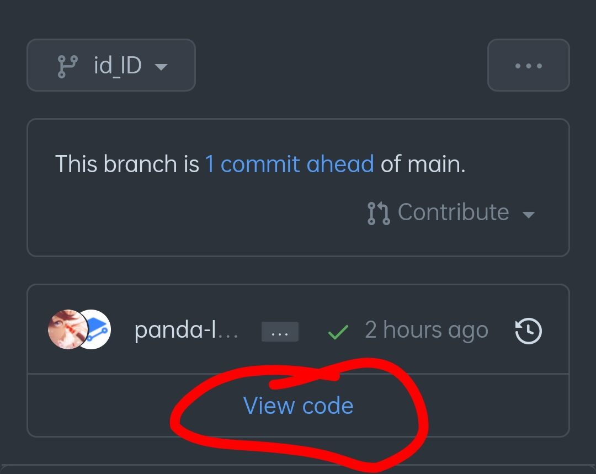
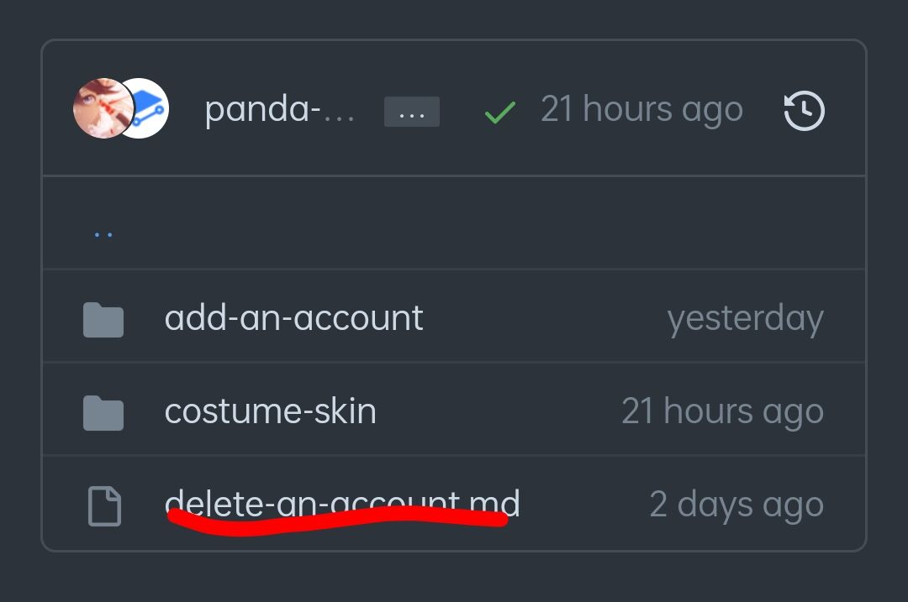
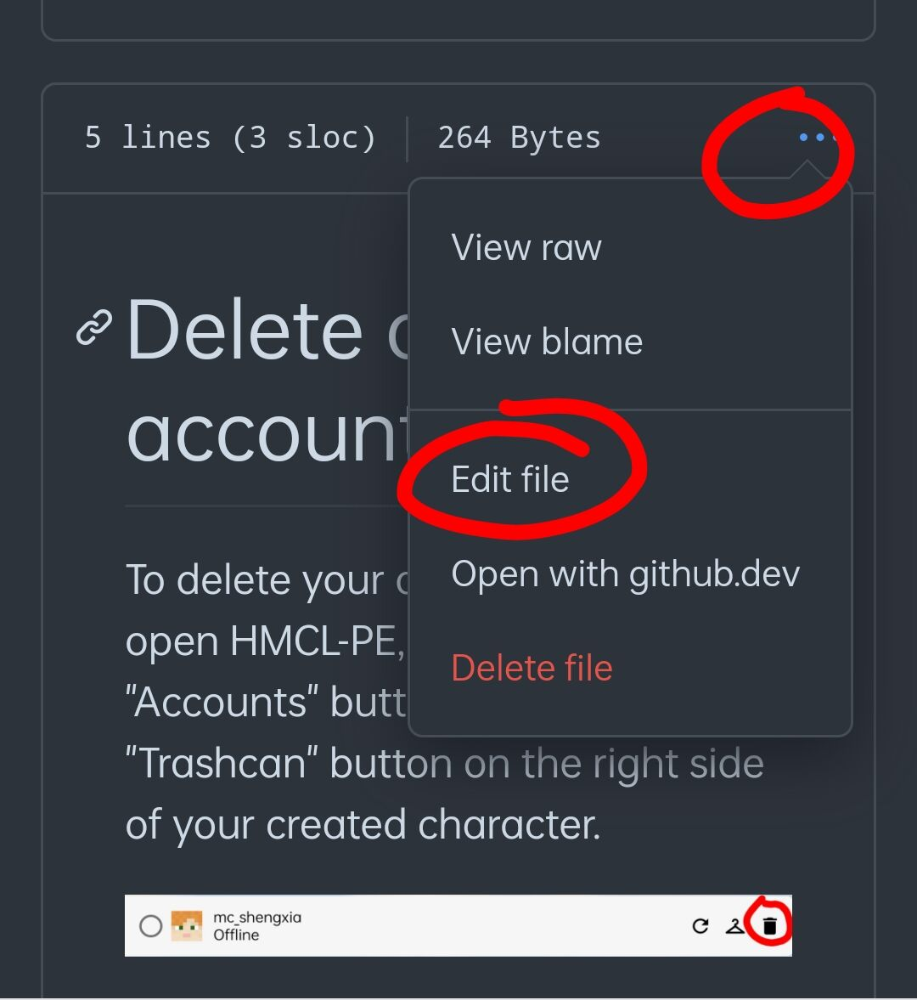
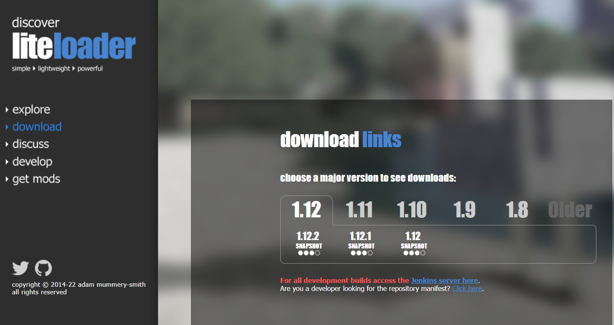

# Contribute to manual

## What can I do?

You now have three ways to contribute to the writing of the manual.

* ****[**Translate**](../#language-support) content into your own language
* Report a content error, submit [**Issue**](https://github.com/panda-lsy/HMCL-PE-User-Manual/issues) on Github
* Submit new content using [**Pull Request**](https://github.com/panda-lsy/HMCL-PE-User-Manual/pulls)****

## Being a translator

In writing the manual, the administrator found that most of the people in **Discord** are not **native English speakers**, so the complex English tutorials **make it difficult** for them to read. You can use translation software to first translate the English content into your own language, then **embellish it** with spoken language and finally make the manual accessible to a wider audience.

### How?

You can do this by changing the file directly and submitting a [**Pull Request**](https://github.com/panda-lsy/HMCL-PE-User-Manual/pulls) for translation.

#### Get a Github Account

You can sign up for a free Github account with your own email address and contribute to the manual.&#x20;

****[**Click**](../asking-questions-by-third-party-software/github/get-your-github-account.md) **** to view the tutorial.

#### Open the HMCL-PE manual, find this button and click on it

#### Click on the "Edit on Github" button

#### Switch to the branch for your language.

You drag down and there are other supported languages


**If your native language is not among the supported languages**, you can let me create a branch by @me at Discord, or by submitting an Issue on Github.


#### Return to the Code Overview page.

#### Code is hidden? Click to show.

#### Find a folder and click on an .md file, then you can start editing.

#### Submit your translated document with a preview

.png>)

#### Just submit.

**Finally, you just need to wait for the administrator to review it.**

.png>)

## Be an issue reporter

You can learn how to submit an issue by clicking [**here**](../asking-questions-by-third-party-software/github/submit-an-issue.md). Go to Github and submit your first [Issue](https://github.com/panda-lsy/HMCL-PE-User-Manual/issues).

## Be a content creator

You can do what the manual says in [**this section**](contribute-to-manual.md#being-a-translator), you can also go check [**here**](../asking-questions-by-third-party-software/github/add-pull-requests-wip.md) for more help (WIP)
